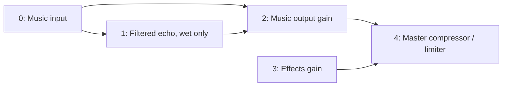

# Bus routing and filtered echo

[Home](../README.md) · [Effects](EFFECTS.md) · [Sources](SOURCES.md) ·
[Provenance](PROVENANCE.md) · [Work](WORK.md)

## Extracted music/echo/effects layout

Phanes's `src/phanes.audio.synth.pas` connects dry music and filtered echo to
one music-output gain, then combines music and a separate effects bus at a
master compressor. The echo filter's output, scaled by 0.23, feeds both the
music return and delay feedback. Music volume uses a 35 ms target time constant;
effects volume uses 15 ms. Muting the music return does not clear the delay.

The native example expresses this with five ordinary buses. The layout is
application policy assembled from reusable processors, not a hardcoded core
distinction between music and effects.



Native low-pass Q is explicitly sqrt(1/2). The compressor uses Pythian's
documented knee and detector policy, and the example adds a sample limiter.
These choices preserve the routing intent without claiming Web Audio sample
parity. Browser context/resume, destination devices, node disconnection,
voice admission and future-note cancellation are separate responsibilities.
The [streaming scheduler](SCHEDULING.md) now supplies the last two.

## Filtered stereo echo

`pythian.echo.TEchoEffect` implements independent left/right rings followed by
a fixed low-pass biquad. For each channel:

```text
filtered[n] = lowpass(ring[position])
ring[position] = input[n] + Feedback * filtered[n]
output[n] = DryGain * input[n] + WetGain * filtered[n]
position = (position + 1) mod DelayFrames
```

The filter is inside the feedback path, so successive repetitions accumulate
filtering. DelayFrames is 1..sampleRate*10; feedback is strictly between -1 and
1; dry/wet gains are 0..16. Frequency uses the biquad design bounds.
The fixed Butterworth low-pass has no resonant gain parameter. Parameters are
immutable after construction; this version does not interpolate delay time,
cross channels, ping-pong, modulate pitch or crossfade a new delay line.

`DefaultEchoSettings(rate)` chooses ceil(rate*3/8) frames, feedback 0.23,
dry gain 1, wet gain 0.23, and cutoff min(1800, rate/4) Hz.
Use DryGain=0 for a dedicated return bus; otherwise a separate dry send would
double the dry signal. Each echo owns two Double rings and a stereo biquad;
ring storage is 16*DelayFrames bytes, independent of rendered duration.

Inputs/outputs and retained samples must be finite with magnitude <=1e100.
Invalid inputs reject before state advances. A failure after filtering poisons
the echo until Reset clears both rings and filter history. Caller outputs
commit together, including crossed in-place calls. FrameCost is 6.
Tail length is explicit; feedback close to unity may decay for a long time.

## Ordered bus graph

`pythian.bus.TBusGraph.Create(rate, settings)` owns 1..32 stereo buses.
Each `TBusSettings` supplies initial Gain and SmoothingSeconds.
`DefaultBusSettings` is gain 1 with a 35 ms time constant. Gains use
`TGainSmoother`: finite 0..16, times 0..60 seconds, zero time immediate.
Only the last bus is the master output. There are no implicit sends.

A frame provides exactly one `TStereoFrame` per bus, including zeros for
buses with no external input. Processing visits buses in ascending index order:

1. Sum that bus's external input with sends from earlier buses.
2. Run its owning serial effect chain.
3. Advance its fader and multiply the chain output.
4. Advance outgoing send gains and add the selected signals to later buses.

`AddEffect(bus, effect)` transfers ownership only on success. Its chain
enforces the existing 32-stage bound and rejects duplicate ownership or rate
mismatch. Keep retained stage references only while the graph owns them.

`AddSend(source, destination, tap, gain, smoothingSeconds)` returns a stable
send index. Source must be strictly less than destination. Forward ordering
makes cycles impossible; delayed feedback is encapsulated by an effect.
Pre-fader taps read **after effects, before the fader**; post-fader taps read
after the fader. One send per source/destination/tap is allowed, with at most
1024 sends. Summation follows ascending source bus and send insertion order.
All buses and configured sends advance even when muted or disconnected;
muting a return preserves the effect's ongoing history.

`SetBusGain` and `SetSendGain` retarget between frames without resetting
current gain. Setting a send target to zero stops future feeding after its
fade; it does not discard already-fed return history. A pre-fader send remains
fed when its source fader is muted. Reset restores initial bus/send gains and
processor history while retaining routing and effect configuration.

Calls are synchronous, on one thread. Recursive processing, reset or graph
configuration from a stage callback is rejected. Built-in frame processing
uses bounded loops and stack scratch storage; this is not a verified device
callback, lock-free host interface, latency-compensated graph or scheduled
command queue. Configure topology outside processing. Custom stages must honor
the effect contract and report stable bounded FrameCost.

Every external input validates and copies before any state advances. A later
stage/mix failure preserves caller outputs and poisons the graph because earlier
buses may already have advanced. Processing/configuration then refuses until
Reset succeeds for every chain and smoother. A failed partial Reset leaves the
graph poisoned. Invalid configuration or preflight input does not poison it.

## Clip rendering and streaming use

`RenderBusClips(clips, graph, tailFrames=0)` borrows its inputs and graph and
returns an owned stereo master clip. The clip array has one entry per bus;
nil is silent, mono duplicates channels, and all non-nil clips must match the
graph rate. Inputs start at the current call's first frame. Rendering lasts
through the longest clip plus explicit zero-fed tail frames.

History continues across calls. For aligned slices, a whole clip and successive
slices produce identical samples, including the tail. Use nil inputs plus tail
frames to drain effects without another source clip. There is no automatic
silence detection or tail truncation.

Preflight bounds output to 64 million scalar samples and 200 million weighted
frame visits. Graph FrameCost includes every chain, bus operation and send-list
scan; it is an admission weight, not a CPU-time estimate.
Preflight rejection preserves graph state. Failure after processing starts,
including Single overflow or output construction failure, poisons the graph
and leaves the caller's previous output assignment intact.

For longer streams, feed `Process` with one frame per bus and send bounded
blocks to `TWavePcm16Writer`, as the demo does. This avoids a full output clip;
the example's input phrases are still rendered offline. The
[scheduler example](SCHEDULING.md) instead streams its sources directly with
admission limits, release and future replacement. Voice stealing is not implicit;
device integration stays at the host boundary. Graph reset explicitly discards
history and must not be used for future cancellation.

## Verification and listening

Checked compiler: existing FPC 3.3.1 i386-win32, flags
`-B -Sa -Cr -Co -Ci -gl`. Focused log:
`build/bus-focused-validation.log`; native example:
`build/bus-demo.log`. Full integration evidence is recorded in [Work](WORK.md).

The fixtures check an independent closed-loop impulse recurrence at a
quarter-rate cutoff, stereo independence, rejected-input history preservation,
reset and crossed in-place processing. Routing checks use independently
calculated sums with multiple inputs, effects, pre/post taps and master gain.
They also exercise separate 35/15 ms exponential responses, backward-edge
rejection, downstream failure, failed reset, reentrant mutation rejection,
and exact split-clip replay including echo tails.

The five-bus extraction fixture proves that music-return mute suppresses
both dry music and echo, leaves the effects bus audible, and restores the same
continuing echo samples as an unmuted reference. Clip budget rejection leaves
state untouched; Single overflow poisons it and preserves the old output.

`pythian.bus.demo OUTPUT.wav` writes six seconds of stereo 48000 Hz in blocks
of at most 1024 frames:

| Time | Signal |
| --- | --- |
| 0..2 s | Short original music phrase with 375 ms filtered echo |
| 2..3 s | Music return fades toward zero; an effects burst remains at 2.5 s |
| 3..4 s | Music and continuing echo return; another effects burst at 3.5 s |
| 4..6 s | Zero-fed echo decay |

The example chooses music gain 0.7 and effects gain 0.4, with 35/15 ms
smoothing. Master processing uses the default linked compressor and a -1 dB
sample limiter. It does not normalize loudness.

Measured PCM output: 288000 frames, left/right peaks 0.2927246094/0.3555603027,
RMS 0.0402339613/0.0330484801. Full metrics:
`build/bus-metrics.json`. SHA256:

`a9ff4f72f18cfb45c7a7af5190368a802a55638a2b1d1dffb12702873fbcc198`

No operator listening approval, cross-platform parity or real-time deadline
measurement is claimed. Subsequent stable compiler/package evidence and the
completed [Phanes removal audit](REFERENCE-REMOVAL.md) retain their separate scope.
