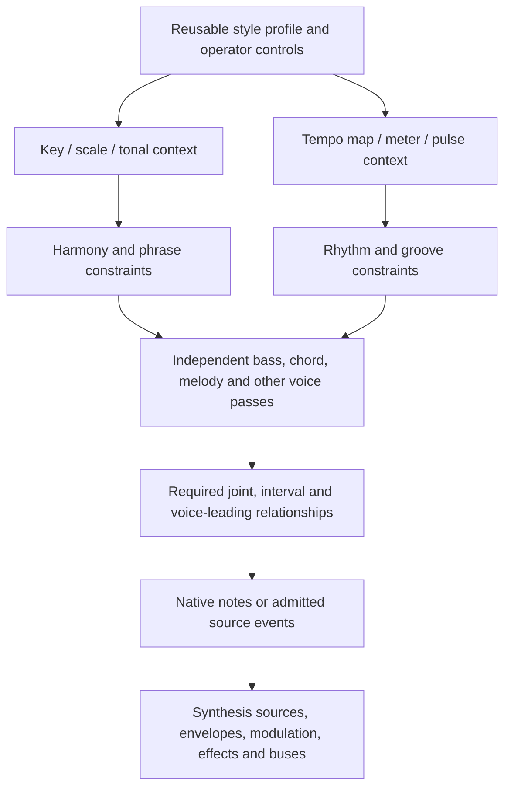

# Layered musical context and reusable style

[Home](../README.md) · [Architecture](ARCHITECTURE.md) ·
[Coupled passes](LAYERS.md) · [Independent voices](INDEPENDENT-VOICES.md) ·
[Work](WORK.md)

## Accepted direction and priority

Pythian must support learning musical style from one song or a collection,
using that style to start generation, and using a derived style as input to
further merges or blends. Control must remain granular: small, reusable layers
compose the whole. WFC's real pass system is the coordination mechanism.

The [semantic graph archive](SEMANTIC-STYLES.md) defines reusable mapped and
named-voice provider configurations with observed runs, source exposure and frozen
vocabulary ancestry, including bound preparation and original-coordinate overlap
audits. Final checked-target QA accepts source/derived replay. It embeds optional
current PYS sound profiles and does not claim a learned phrase vocabulary.

Core audio/synthesis fundamentals remain the priority. This document records
the required architecture and its gaps. Automatic WAV key/tempo admission and
recorded voice/joint admission and weighted semantic blends remain open.

[Saved WAV onset styles](WAVE-STYLE.md) now support measured onset-presence
learning, weighted independent recording samples and repeated saved blends.
Actual key/tempo/onset passes feed the dependent five-pass voice stack. Rhythm
pins preserve independent key/tempo results while changing synthesized attacks.
Pitches, voicings and gates remain authored; this is limited onset-style coverage,
with explicit source clocks and provenance, rather than learned voice roles.

[Measured onset dynamics](ONSET-DYNAMICS.md) adds RMS evidence and actual joint
timing/intensity history to those saved weighted styles. Intensity-only edits
preserve accepted onset/key/tempo states, and voice domains enforce generated
relative intensity. This measures aggregate attack energy; independent source
voices and polyphonic pitch transcription remain unsupported. Dense monophonic
duration learning below adds measured gate extents through a separate capability.

[Periodic pitch learning](PITCH.md) now provides single-source frequency candidates
and weighted note-run models for declared monophonic WAVs. Unknown intervals split
training samples. Current PYS styles retain these measurements and weighted
models through repeated blends; an actual pitch pass now controls melody in the
dependent voice stack. Pitch-only edits preserve key/tempo/onset/intensity states.
Independent source weights select or blend pitch separately from rhythm and its
observed joint intensity history. Matching source vectors also retain observed
pitch/onset/intensity runs. Explicit coupled generation uses a shared actual WFC
provider and projections into separate consumers; edits regenerate that closure
while preserving key/tempo. Independent mode remains available. This establishes
cell co-occurrence, not note-onset ownership, note lengths or polyphonic roles.
These measurements must not be treated
as extracted bass/melody from mixed music; the recorded Pixel inspection does not
pass the current periodic admission policy.

[Dense pitch duration learning](PITCH.md#dense-measurements-and-learned-duration)
now retains stable monophonic note extents and explicit silence/unknown intervals
through a saved actual WFC model. Dense evidence now participates in current
style profiles and weighted second derivations. A named key/tempo/performance
session renders measured durations, preserves context through duration edits and
accepts independent output-tempo selection. Duration uses pitch-source weights
to retain observed relationships. [Duration-driven accompaniment](INDEPENDENT-VOICES.md#measured-duration-driving-dependent-voices)
now carries those spans through the five-pass voice stack into exact bass/chord/
melody gates. Accompaniment pitches and timbre remain authored.

[Typed musical context](MUSIC-CONTEXT.md) now provides owned key/tempo timelines
and explicit scoped PPQ grids. A companion adapter learns separate key and tempo
providers from admitted excerpts. Its actual four-pass example checks independent
context pins feeding bass, gate length and the native output clock. The source
labels are authored; automatic extraction/admission from WAV evidence and general
semantic layer registration remain separate work.

[Explicit WAV context admission](WAVE-CONTEXT-ADMISSION.md) now binds measured
tonal rankings to a caller-selected key (including unknown), a declared constant
tempo and an exact complete-cell scope. Its saved profiles retain source and
report hashes and generate through actual key/tempo passes. Explicit local key
regions now carry independent regional measurements into changing saved providers,
second blends and voice generation. Region boundaries and labels remain caller
decisions. Automatic key-change admission, downbeats and richer voice dependencies
remain separate work; measured tempo candidates and selected local clocks are
covered by the timing workflows below.

The [independent-voice operator](INDEPENDENT-VOICES.md#saved-context-feeding-the-voice-stack)
now consumes saved profiles: actual key/tempo passes precede rebuilding and
solving harmony/rhythm/bass/chord/melody models. Known constant major/minor keys
map an authored score by scale degree; generated tempo drives audio and MIDI.
This proves context-driven voice realization. The duration path also supports
finite changing key/tempo providers: key changes apply at new accompaniment
attacks while sounding notes and absolute measured melody remain intact. Learning
those voice behaviors from mixed WAV and general semantic dependency control remain open.

[Selective context profiles](CONTEXT-PROFILES.md) now wrap one/multi-source
admitted bundles and select key and tempo from different saved profiles.
Derived results can be selected again, retaining complete parents, source scopes
and actual models. The four-pass demo consumes saved two-stage selections.
These context profiles establish selection and lineage. The separate onset-style
profile adds weighted rhythm blending; joint voice styles and extraction of
independent voices from mixed recordings remain open.

The native realization layer now includes reusable
[periodic and composed automation controls](MODULATION.md#periodic-and-composed-controls)
for independent pitch, gain, pan and cutoff movement. These keep sound controls
modular without adding solver dependencies to synthesis. Future style providers
must explicitly map their musical time and parameters into these note-relative
definitions; shared LFO definitions alone do not provide shared global phase.

## Learning a style from many hours

The intended high-level styles include **chillwave, stoner rock and lofi**. These
are caller-provided corpus labels, not classifications inferred by the current
library. A style may be learned from a long recording or many recordings, then
saved, used for generation and reused as a parent in subsequent selective blends.
Many hours of input should broaden observed behavior, not merely enlarge a
collection of interchangeable source grains.

The [corpus evaluation protocol](CORPUS-EVALUATION.md) now specifies source-family
isolation, initial coverage floors, fixed generation/listening comparisons and
blend/reblend review. The existing source inventory is development-only; verified
song identities, style cards and independent evaluation groups remain to be added.

This extends the existing architecture through the following open requirements:

- **Bounded long-source ingestion:** stream decode, conversion and analysis in
  bounded windows; retain source coordinates and the history each algorithm
  actually needs. Resume interrupted work without relearning completed material.
  Chunk overlaps must not duplicate observations. Reset musical history across
  unrelated recordings or declared song boundaries, never merely because a
  processing chunk ended.
  The core now supplies [feature batches](ANALYSIS-WAVE.md#batches-and-source-coordinates)
  with Int64 source coordinates and reconstructed flux context. A
  [persistent feature journal](ANALYSIS-WAVE.md#persistent-feature-journal) binds
  progress to source identity/options and commits observations before advancing
  its next index. Changed bindings reject; incomplete final writes can recover.
  The next consumer must aggregate that evidence with stable vocabulary and
  recording/song boundaries. Batch extraction and storage do not train a style.
- **Corpus aggregation and balance:** accumulate compatible measured evidence
  across recordings while retaining source identity, uncertainty and independent
  rhythm/pitch/timbre/envelope weights. Make duration and source weighting explicit
  so one long or repetitive recording does not silently dominate a style.
  Preserve vocabulary and timebase contracts when adding material; rebuild
  affected models explicitly if those contracts change.
  [Journal training](ANALYSIS-WAVE.md#training-from-journals) now provides a bounded
  palette trainer, counted WFC adapter and representative-window auditions at Int64
  source coordinates. Whole-array entry points retain their 65536-observation cap.
  The new path keeps sequence history across journal batches and resets it only at
  declared segments, using public companion contracts and existing state limits.
  The maintained [range workflow](ANALYSIS-WAVE.md#selecting-sections-without-copying-audio)
  now exposes selected sections of one long journal as separate weighted samples,
  preserving boundaries through saved styles, further blends and replay without
  copying the WAV. These are declared boundaries, not automatic song segmentation
  or independent recordings for held-out evaluation.
  Explicit integer recording multiplicity weights both palette and WFC evidence;
  it is not automatic duration normalization or a generated-source quota. A shared
  vocabulary must be fixed before accumulating compatible model evidence.
  [Saved journal profiles](ANALYSIS-WAVE.md#saved-journal-profiles) now bind exact
  ordered centers, analysis/timebase and serialized model bytes. Source-bound
  replay needs no caches or retraining; `--palette-from` trains new evidence in
  the saved vocabulary and retains parent digests. Exact compatibility checks
  reject independently changed palettes. Combining these saved acoustic models
  now supports weighted [saved acoustic blends](ANALYSIS-WAVE.md#blending-saved-journal-models)
  and a further derived blend. Actual state/boundary counts combine without
  retraining; repeated source ranges coalesce with explicit cumulative weights.
  Flat training lineage and immediate parent identities survive reload. This
  clears [WAV-04-BLENDS](WAV-STUDIES.md#journal-blend-checkpoint)'s mechanical reuse gate;
  semantic provider admission and musical acceptance remain separate.
  [Candidate selection](ANALYSIS-WAVE.md#journal-candidate-selection) now retains
  bounded alternatives across each segment's time bins and supplies independent
  generation weights and bin rotation. Optional
  [join planning](ANALYSIS-WAVE.md#journal-join-planning) preserves per-token/segment
  counts and locked windows while reducing local join cost through bounded waveform
  probes. An explicit local swap radius now admits sustained passages within the
  same work budget. The [paired study](WAV-STUDIES.md#journal-sustained-checkpoint)
  exposes repeated short-window use and reduced effective diversity despite lower
  seam mismatch. [Continuation work](MILESTONES.md#wav-04-continuation) therefore
  remains linked to musical acceptance. Sustained phrase quality and independently reusable semantic providers
  remain open; matching token names alone cannot make
  different palettes mergeable. Source-grain shares do not measure perceptual blend.
- **Reusable musical providers:** aggregate admitted base context, rhythmic and
  harmonic behavior, part relationships and supported instrument behavior into
  the current style contract. Actual WFC base passes feed dependent part passes.
  A caller can select, lock or blend supported dimensions independently; a derived
  style remains a valid parent for another saved blend. Acoustic/activity corpus
  reconstruction alone does not establish this semantic style representation.
- **Style-level evaluation:** separate development and held-out material by
  recording or song, not just by adjacent excerpts. Examine source contribution,
  repetition, continuity, unknown coverage and supported musical behavior across
  a declared set of seeds. Compare generated behavior with independent recordings
  and listening observations. A successful file render or recognizable reused
  fragment does not establish a well-rounded style.

The [initial WAV-source passes](WAV-STUDIES.md#initial-wav-source-passes--2026-09-15)
exercise nine short excerpts and saved acoustic/activity generation. They do not
run many-hour training, establish all of these requirements or close genre-style
learning. Their observed gaps are backlog inputs; core synthesis remains the
priority. Extend current contracts rather than retaining obsolete development
formats or creating a separate archive generation for every experiment.

## Dependency layers

[Harmonic/percussive separation](SEPARATION.md) now provides an optional native
preprocessing stage. Derived components retain the source clock and exact extent;
their own byte identities and transformation-report hashes enter saved learning.
Percussive onset/dynamics evidence already reaches repeated styles and actual
WFC voice generation. Harmonic/percussive labels describe spectral behavior,
not learned instrument or musical voice roles. Removing transients does not
authorize treating the harmonic component as monophonic.

Separate musical context from voice realization and audio rendering.
An intended dependency layout is:

This is a dependency graph, not a fixed list of instruments or a requirement
that every project use every layer. Joint relationships may instead provide
voice choices where that gives better bounded solving; the current layer adapter
already supports both arrangements. A key, harmony or rhythm layer must not
imply that arbitrary marginal voice combinations were observed together.

Each layer should declare a semantic identity, current schema, input/output
vocabulary, dependencies, time domain and scope. Key might apply to a song or
section, tempo may vary over time, harmony may change once per bar, and voices
may act several times per beat. Compilation into WFC cells needs explicit
broadcast/resolution and source-to-musical-time mappings. Do not interpret an
FFT hop index as a beat or silently force every layer to one analysis resolution.

A selected tempo context drives the exact output clock; it does not independently
retime a source WAV. Tonal selection likewise does not silently transpose audio
or turn acoustic palette classes into notes. Transformations require their own
supported native operation and recorded policy.

The operator should be able to pin a layer or interval, choose a learned provider,
supply a supported preference/blend, replace a model, or regenerate selected
dependent layers. A changed provider invalidates affected descendants and their
joint constraints. Previously accepted independent context stays explicit;
already committed stream audio cannot be retroactively regenerated.

Current WFC constraints provide hard token restrictions and bounded negotiated
retries. A weighted preference is not interchangeable with a hard constraint.
The [named session API](LAYERS.md#named-sessions-and-selective-regeneration) now
owns detached models and supports replacing positional masks, clearing edits and
actual dependency-scoped regeneration. It preserves accepted independent latent
states and includes pending provider edits in the active scope. Compatible
[model replacement](LAYERS.md#transactional-model-replacement) now rebuilds and
validates a candidate while preserving independent states and existing masks.
Names, scopes and relations remain fixed. Session names are caller identities.
The grid and duration APIs now expose detached
[provider descriptions](GRID-STYLE.md#provider-descriptions): typed observed
choices, actual dependencies, saved preferences and explicit timing semantics.
These support discovered controls without inferring voice ownership. General
semantic schema registration, model migration and scoped recompilation across
resolutions remain planned. Runtime [token preferences](LAYERS.md#generation-preferences)
and [saved preference derivations](WAVE-STYLE.md#saved-generation-preferences) are
implemented; general semantic role controls remain under
[WFC-LAYERS](MILESTONES.md#wfc-layers).
Declared uniform grids and [fixed unequal partitions](LAYERS.md#fixed-time-partitions)
support explicit start-tick and whole-cell relationships between unequal pass
scopes. Durations selected during a solve and source-to-musical-time admission
remain separate.

WFC's specialized finite music and ensemble pipelines already expose selective
regeneration. They include dirty providers in the affected pass closure, and the
ensemble pipeline can lock an individual voice slot within its joint vocabulary.
This is existing companion functionality with
[checked source and runtime evidence](PRECURSOR-BOUNDARIES.md#finite-pass-pipelines-and-selective-regeneration).
Reuse it where its fixed three-pass contract fits. A general semantic layer
interface in Pythian, cross-schema replacement and automatic WAV admission remain separate
work; selective regeneration does not itself provide style blending.

## What a style contains

Style is more than key and BPM. A reusable profile should retain independently
usable evidence/models for the dimensions the source supports, for example:

| Dimension | Candidate evidence or model |
| --- | --- |
| Tonal context | Ranked tonal fits, relative pitch intervals, harmonic movement |
| Timing | Tempo candidates/maps, pulse uncertainty, duration distributions, groove |
| Voice behavior | Role-specific range, density, register, contour and articulation |
| Relationships | Observed joint events, vertical intervals and temporal dependencies |
| Sound | Acoustic descriptors, source/timbre choices and dynamic envelopes |
| Larger structure | Repeated motifs, phrase boundaries and section relationships |

A dimension can be unknown. Mixed WAV audio does not currently yield reliable
isolated bass/melody parts or instrument identity. Existing acoustic measurements,
pulse/event timing and source slices are useful evidence, but cannot be relabeled
as a transcription or a complete style merely because a model can generate them.

Retain both source-specific measurements and any explicit normalized representation.
For example, relative pitch or beat-relative duration can help compare sources
in different keys/tempos, but require admitted references and documented
quantization/transposition policies. Keep absolute source frames, original pitch
data when available, timing uncertainty and transformations recoverable.

## Profiles, merging and repeated blending

The reusable artifact is an immutable profile using one current native format, with per-layer
models/evidence, dependency and joint relationships, vocabulary/timing schemas,
source attribution, extraction policies and a provenance graph. A derived profile
must have the same input role as an original profile so it can seed another
generation or another blend.

Existing WFC composition text is a different artifact: it saves public tokens,
timing and a score, but no learned models, source evidence, latent capture or
blend lineage. Do not use it as a style-profile archive or resume checkpoint.
The [serializer review](PRECURSOR-BOUNDARIES.md#score-and-composition-text)
records that boundary. A saved style describes reusable learning; a resumable
generation additionally needs validated continuation state bound to its models.

Combination should be selectable per layer: take rhythm from A, bass behavior
from B, combine compatible harmonic evidence from both, and pin output key or
tempo independently. A later profile C can extend or replace selected layers of
that derived result. This must not require flattening the whole song into one
token stream or replacing the synthesis backend.

Before combining:

- Reconcile role identities, pitch/timing references, feature schemas, palettes
  and source mappings. Two independently learned acoustic index values do not
  name the same sound.
- Retain separate source/excerpt/run boundaries. Pooling observations must not
  teach transitions across song boundaries or excluded tracking gaps.
- Preserve necessary joint evidence. Combining marginal distributions alone can
  permit voice/harmony/rhythm combinations absent from the contributing material.
- Declare weighting and normalization per layer and retain source contributions.
  When a parent profile and one of its ancestors are both inputs, an explicit
  policy must resolve repeated evidence rather than silently double-count it.
- Record derived lineage, overrides, conflicts and algorithm versions. Incompatible
  hard constraints should report a conflict or bounded solve failure; do not
  silently drop an input's requested constraint.

Shared-vocabulary reconstruction or relearning through the actual WFC learner
may be required. Averaging serialized model bytes, concatenating independent
palettes or treating arbitrary generated output as verified training evidence
is not a supported merge method. Weighted source learning is implemented for the
current onset, intensity, pitch and duration capabilities, including repeated
derivations. General model composition remains under
[WFC-STYLE](MILESTONES.md#wfc-style). The generic
[layer API](LAYERS.md#generation-preferences) now supports positive per-token
generation multipliers, owned session edits and selective regeneration without
altering training counts. [Saved preferences](WAVE-STYLE.md#saved-generation-preferences)
retain supported provider settings through reload and repeated blends. General
semantic role controls remain under [WFC-LAYERS](MILESTONES.md#wfc-layers), and
broader recorded/consumer acceptance under [integration](MILESTONES.md#wav-04-integration).
Historical format readers are not a roadmap milestone;
superseded development artifacts are regenerated under the project format policy.
Do not assume repeated blends are associative or order-independent unless the
defined policy and evidence prove it.

## Existing support and remaining gaps

| Requirement | Current evidence | Still needed |
| --- | --- | --- |
| Real dependent WFC passes | `pythian.wfc.layers`: models, per-layer locks, complete projections, negotiated solve and independent capture; typed provider contracts, owned uniform/unequal mappings and staged generated-duration context through `pythian.wfc.duration.stream` | Admitted recorded providers and their integrated musical acceptance |
| Selective finite musical edits | Actual WFC music/ensemble pipelines reuse clean providers, include dirty dependencies, negotiate repair and support ensemble voice-slot locks; native named sessions also replace compatible models transactionally | Integrate through semantic Pythian layer controls; cross-schema/time mapping and streaming edit policies |
| Context feeding independent voices | Saved key/tempo passes feed the five-pass voice operator; finite changes map to cumulative performance ticks, preserve sounding notes and drive exact audio/MIDI clocks | WAV-derived voice behavior and general joint/dependency controls |
| Tonal and timing evidence | Regional tonal fits with explicit key/unknown selection; selected local pulse tracks, exact PPQ clocks and saved changing providers | Calibrated automatic local key and tempo/downbeat admission, meter/other modes, unknown-tempo handling and broader annotated accuracy |
| Several WAV sources | Shared acoustic/joint corpora and a shared event vocabulary with source identities and separate samples | General per-layer style extraction and cross-schema normalization |
| Safe event boundaries | Onset/pulse intervals, independent admitted runs, shared event vocabularies and weighted rhythm/pitch/duration source samples retain recording boundaries | Broader role-specific extraction and cross-schema normalization |
| Reusable saved learning | Current styles retain context, weighted onset/intensity/pitch/duration models, independently selected measured envelopes and saved spectral trajectories, supported joint constraints and repeated-blend lineage | Admitted learned voice roles and changing-pitch timbre, phrase/section dimensions and semantic provider composition |
| Rendering modularity | Native sources, envelopes, modulation, effects and buses; [public performance API](PERFORMANCE.md) provides owned providers, typed locks and detached timed plans | Broader admitted layered outputs without inferring unsupported WAV voices |

The [current north stars and active backlog](MILESTONES.md#north-star-assessment)
own these remaining outcomes. Musical inference belongs to NS-3, composition and
control to NS-4, and many-recording style quality/structure to NS-5; none is
completed by an authored accompaniment example. Cross-contract normalization
means explicit vocabulary and musical-time mapping, not retaining obsolete file
format readers. Saved evolution and measured-envelope mechanisms are implemented;
their automatic recorded admission and listening acceptance remain separate.

The generic layer adapter supports 1..8 layers with bounded
[independent per-pass counts and extents](LAYERS.md#per-layer-scopes). These are real limits, not permission to silently allocate an unbounded
key/tempo/harmony/rhythm/voice graph. A larger stack needs explicit hierarchical
planning or a measured extension of those bounds. The WFC independent-voice
graph supplies a separate specialized contract; do not claim the two APIs have
identical capabilities.

The [recorded duration workflow](PITCH.md#recorded-instrument-evidence) exposed a
specific resolution mismatch: a source can have two key/tempo grid cells but
three dense performance spans. Explicit held-context generation now solves one
actual prefix state from each single-valued saved context model, independently
of performance count. The operator holds those decisions to the output endpoint,
preserving model/source identities and unknown key. Changing values reject.

Finite changing context is also implemented: independently counted key and tempo
prefixes map through the saved context grid to cumulative performance ticks.
Context must cover the full generated duration. The public performance API owns
these models, creates real named sessions and captures detached native plans with
typed locks and explicit coverage validation. The voice operator consumes it.
The corresponding [saved-grid API](GRID-STYLE.md) now owns key/tempo, onset,
optional intensity/pitch and observed joint pitch/rhythm passes. It exposes typed
locks and detached capture, validates model paths and joint relationships, and
preserves unknown/changing context independently of the demo's arrangement policy.
Both APIs are reusable companion contracts; general semantic role registration
and admitted mixed-source providers remain separate work.
The generic layer adapter separately maps declared uniform tick grids and
[fixed unequal partitions](LAYERS.md#fixed-time-partitions), with owned timing and
bounded position compilation. The accepted [duration/stream adapter](DURATION-STREAMS.md)
stages generated durations and cumulative timing before dependent context/voice
solving and native scheduling; it does not change timing during a single graph solve. Do not silently
repeat observations, erase changes or describe a hold as measured source duration.

## Implementation sequence and acceptance

Global [measured tempo candidates](WAVE-CONTEXT-ADMISSION.md#measured-tempo-candidates)
now supply explicitly selected base clocks through the existing saved profiles,
source weighting and second-blend generation path. Alternative metrical levels
remain visible; no automatic rank, beat phase or downbeat is claimed. Finite
context providers now align their grid changes with independent duration spans;
automatic extraction of a reliable local tempo map remains open.

Continue extracting and verifying reusable audio fundamentals. Typed key/tempo
context and a small actual WFC provider example now establish the first musical
time contract. Explicit WAV admission now binds measured tonal evidence to saved
providers. Saved profiles, repeated weighted combinations and dependent voice
generation now retain explicit timing, source lineage and joint relationships.
Continue broadening admitted recording behavior and timed context coordination
without silently flattening different resolutions or counting authored voice
choices as measured style.

Current recorded workflows demonstrate single-source learning, multi-source
styles, selective weighted blends and a further blend using a derived profile.
Round trips retain lineage and actual model semantics; granular edits preserve
accepted independent providers. These results cover the admitted dimensions,
not a complete song style. Extend the same acceptance to broader recordings and
learned voice/timbre/phrase behavior. Audible results and operator control matter;
longer files or additional token counts alone do not prove style transfer.

Stationary timbre now survives the same current-format source/profile and repeated
blend workflow. Its independent source weights combine measured harmonic
magnitudes; the result feeds native synthesis after actual musical passes solve.
Timbre-only selection preserves their states and MIDI while changing stereo
audio. This is a static synthesis dimension, not another learned temporal WFC
model. Independently selected per-zone timbre identities are now retained by the
instrument adapter; saved evolving shapes are described below;
see [saved timbre](WAVE-STYLE.md#stationary-timbre-and-rendering).

The native [spectral trajectory source](SOURCES.md#spectral-trajectory-checkpoint)
renders 2..32 spectra with note-relative timing and shared phase. The
[saved provider](WAVE-STYLE.md#saved-spectral-trajectories) now retains raw
source-bound fits and declared timing in the current style contract. Repeated
blends combine unit-RMS magnitude shapes at the union of source knot times;
modeled level and independent envelopes remain separate controls. Paired role
edits preserve unrelated audio and MIDI. Stationary-only styles retain their
existing amplitude behavior; mixed trajectory/static styles explicitly normalize
both kinds of source. This is not perceptual loudness matching.
[WAV-03-TIMBRE](MILESTONES.md#wav-03-timbre) retains the recorded-quality and
changing-pitch gates. Declared-region evaluation is independent of phrase
admission; automatic event assignment depends on it. No general mixture ownership
or listening acceptance is supplied by saved control isolation.

Explicit-region RMS traces now survive saved styles with independent envelope
weights, declared gates and truncation limits. Second blends retain raw evidence
and yield detached native envelopes. Public return values can bind individual
voices; the original voice operator shares one result across its roles. The
[instrument consumer](WAVE-STYLE.md#independent-measured-instruments) now combines
independently selected timbre and envelopes per bass/chord/melody role, with owned
measured factories and copied controls. Envelope-only edits retain the other
sounding stems, stationary timbre and accepted MIDI. Bounded sustained instrument
playback and exact read-block replay are recorded in the
[instrument evidence](WAVE-STYLE.md#independent-measured-instruments).
Broader recorded voice/phrase learning and calibrated context admission remain open.
